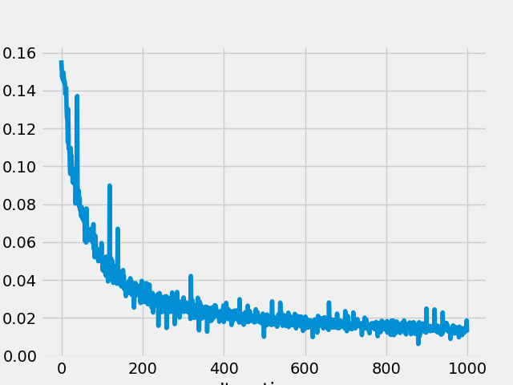
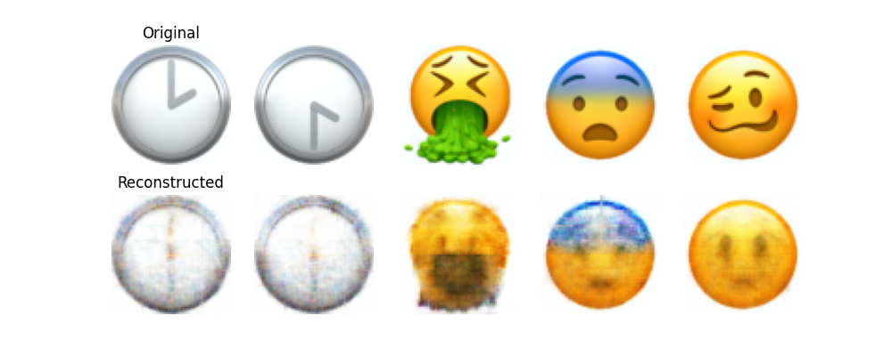

# AutoEncoders

1. 

a. The original dataset consists of many images of emojis that are of size 256x256. I started by using the datasets library to download the emoji dataset from huggin face. After this, dataset needed to be augmented and split into training, validation, and test sets. The first augmentation step was to gather a subset of a the data based on the text in the label. We chose to use the text "face", which includes grinning face, winking face, etc. The gave us ~200 images to work with in total. We then split this set into training, validation, and test with a 60, 20, 20 split respectively using the train_test_split library from sklearn. The next augmentation that needed to be done was to create more data for each split. We created an augment_data function that applied PyTorch transformations to the data that randomly flipped the images, resized them to 3, 64, 64, and converted the images to tensors. We did this 5 times for each set that multiplying the number of images by 5. 

Original train set: 122, Augmented train set: 610
Original valid set: 41, Augmented valid set: 205
Original test set: 41, Augmented test set: 205

Finally, we created a loader for each set to easilt iterate through the images when passing them to our model.

b. The architecture consists of 5 layers for the encoder and 5 layers for the decoder. We use a "hourglass" architecutre, as do most autoencoders. The first layer is the number of channels (3, RGB) to 128. We use Convolutional Layers to reduce the dimensions to a 2x2 using a kernel size of 3, stride of 2, and padding of 1 for each layer to eventually decrease the image to a 2x2. Then, that output is ran through the decoder, which uses `ConvTranspose2d` which is similar to the inverse of Conv2d. This layer expands the encoded input back into an output that follow the dimensions of the batch size, channels, width, and height. We then utilize these in the forward method of the AE model.

c. At first, we were using linear layers, which are not as well suited for image inputs, so switching to Conv2d was essential. We started with an arbitrary number of layers and made sure to match the encoder to the decoder. The main challenge was making sure that input image size was matched by the output size. This took some trial and error, as well as calculating the kernel size, stride, and padding with this formula:

Output size = ((Input size + 2 * Padding - Kernel size) / Stride) + 1

For our training script, we made the mistake of making the learning rate too high which caused our model to not learn very well. After dropping the learning rate, the loss decreased quite nicely. Increasing the number of epochs also helped with decreasing the loss, as we found our model needed more time to reach a local minimum. 

d. Hyperparameters:

- Layer Type
- Number of input/ouput channels per layer
- Number of total layers
- Batch size
- Learning Rate
- Resize 
- Transformations
- Loss Function
- Weight Decay
- Optimizer
- Epochs

e. 

**Training**

**Validation**

f.

g. 

